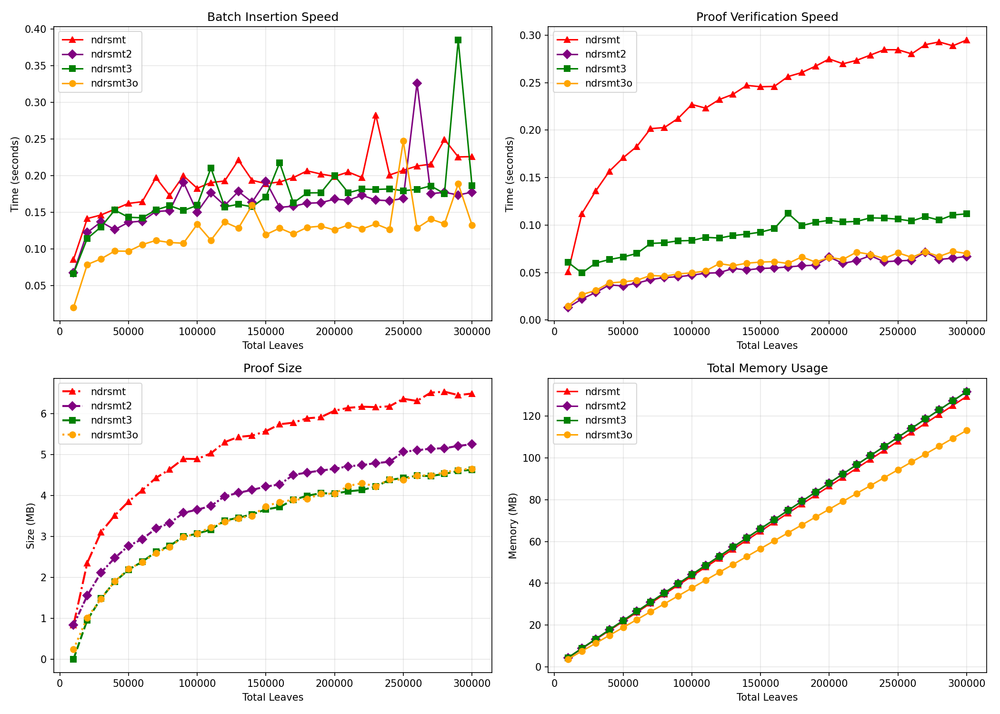

## Optimizing the Consistency Proof of (Radix) Sparse Merkle Tree

### Threat model
See `ndrsmt3o.py` header:

```py
# Threat model:
#   - The untrusted operator controls the tree and proof generation.
#   - Root hashes are committed to a trusted repository.
#   - The verifier and batch B are trusted inputs.
#   - (We ignore how leaf validity is established.)
```

### Implementations

- **`ndsmt.py`**  
  Baseline Sparse Merkle Tree (SMT), as originally used for
  [zk experiments](https://github.com/unicitynetwork/aggr-layer-paper/). Hashing rule based branch compression.

- **`ndsmt_opt.py`**  
  Functionally equivalent to previous, performance-optimized. Lost the simplicity and regular structure.

- **`ndsmt_lmdb2.py`**  
  Same tree and consistency proof, but backed by an on-disk KV store (LMDB) instead of pure in-memory radix tree.  
  Memory usage is reduced by `(total_leaves / max_batch)` minus LRU cache.

- **`ndrsmt.py`**  
  Radix tree copying the 
  [aggregator-go](https://github.com/unicitynetwork/aggregator-go), Provides consistency proof which is basically brute forced to be compatible by excess complexity (too many opcodes); still one opcode less than full compatibility but this does not affect the performance (see file header). 

- **`ndrsmt2.py`**  
  Hashes the full leaf key together with the leaf value, freezing the tree topology.  
  This simplifies most computations and removes half of the opcodes in the consistency proof (see header).

- **`ndrsmt3.py`**  
  Further simplifies the consistency proof. Less opcodes, single-pass verification, uses recursion.

- **`ndrsmt3o.py`**  
  Optimized version: no recursion or lookups or indexed data structs in consistency proof verification, with documentation and **security argument** in the header.

### Benchmarks

- `bench*.py` -- testing and evaluation harness

Effect of proposed change: (ndrsmt3o) vs baseline (ndrsmt), with batch size of 10000 leaves: 

