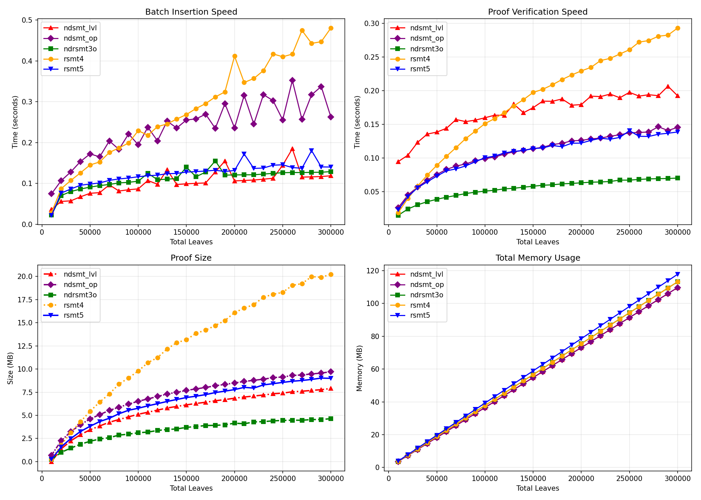

## Optimizing the Consistency Proof of (Radix) Sparse Merkle Tree

### Threat model
See `ndrsmt3o.py` header:

```py
# Threat model:
#   - The untrusted operator controls the tree and proof generation.
#   - Root hashes are committed to a trusted repository.
#   - The verifier and batch B are trusted inputs.
#   - (We ignore how leaf validity is established.)
```

### Implementations

- **`ndsmt.py`**  
  Baseline Sparse Merkle Tree (SMT) with implicit blank leaves and path compression. Originally used for
  [zk experiments](https://github.com/unicitynetwork/aggr-layer-paper/). 
  Consistency proof is levelized array of untouched sibling subtree roots.

- **`ndsmt_lvl.py`**  
  Functionally equivalent to the previous, performance-optimized. Lost the simplicity and regular structure.

- **`ndsmt_lmdb2.py`**  
  Same tree and consistency proof, but backed by an on-disk KV store (LMDB) instead of pure in-memory radix tree.  
  Memory usage is reduced by `(total_leaves / max_batch)` minus LRU cache.

- **`ndsmt_op.py`**  
  Tree is the same as previous, consistency proof is a flat post-order opcode stream.

- **`ndrsmt.py`**  
  Radix tree copying the 
  [aggregator-go](https://github.com/unicitynetwork/aggregator-go), Provides consistency proof which is basically brute forced to be compatible by excess complexity (too many opcodes); still one opcode less than full compatibility but this does not affect the performance (see file header). 

- **`ndrsmt2.py`**  
  Hashes the full leaf key together with the leaf value, freezing the tree topology.  
  This simplifies most computations and removes half of the opcodes in the consistency proof (see header).

- **`ndrsmt3.py`**  
  Further simplifies the consistency proof. Less opcodes, single-pass verification, uses recursion.

- **`ndrsmt3o.py`**  
  Optimized version: no recursion or lookups or indexed data structs in consistency proof verification, with documentation and **security argument** in the header.

- **`rsmt4.py`**  
  Proves also canonical inserts, while maintaining the same inclusion proof format and tree internal node hashing. Batch insertion scales linearly. Dead end.

- **`rsmt5.py`**  
  Proves also canonical inserts; internal nodes include traversal range

- **`rsmt5a.py`**  
  Functionally same, simpler but just a bit bigger inclusion proof format.


### Benchmarks

- `bench*.py` -- testing and evaluation harness

Effect of proposed change: (ndrsmt3o) vs baseline (ndrsmt), with batch size of 10000 leaves: 


## Guarantees

Valid consistency proof guarantees:

- Completeness: all (unique, new) elements in `B` inserted
- Pre-state preservation: no previously added leaf can be deleted or modified
- Batch incorporation: Every (unique, new) inserted leaf appears in post-state keyed by its id
- No phantom insertions: Every new post-state leaf is justified by an entry in `B`
- Canonical inserts: post-state tree topology is uniquely determined by the committed keys

### Canonical Inserts

Every implementation above verifies preservation of committed subtree hashes
and batch incorporation into the post-state hash, but it does not automatically imply
that the resulting post-state is a well-formed radix tree whose topology is
uniquely determined by the committed keys (**canonical**).
This may result in leaves without valid inclusion proofs.

The classical SMT versions (`ndsmt*.py`) are by construction canonical.

`ndrsmt3o.py` commits each internal node only to (left_hash, right_hash, depth).
That is enough to prove insert-only integrity of previously committed subtrees,
but not enough to prove that the post-state radix topology is canonical for
the committed keys. An untrusted operator can preserve every old subtree hash
and still arrange the changed frontier into a malformed post-state whose root
matches the proof, leaving some leaves without valid inclusion proofs.

RSMT4 fixes this by opening old boundary leaves in the consistency proof and
checking every changed split against authenticated neighboring keys. That is
sound, but it makes the touched frontier much wider: more proof operands,
more leaf hashes during verification, and more work, especially more hash
function calls, for consistency proof checking.
This is basically a brute-force approach to keep the inclusion proofs compact.

RSMT5 takes another compromise. Each internal node hash commits to the
subtree's authenticated traversal-order range `[lo, hi]` in addition to child
hashes and split depth:

    H_node(lh, rh, depth, lo, hi)

This lets an opaque unchanged subtree ('S') carry enough authenticated
boundary information for ancestor canonicality checks without reopening old
leaves. Consistency proof generation stays in the one-pass RSMT3 style, and
consistency verification uses the same number of hash invocations as RSMT3
for an equivalent proof skeleton.

The cost is shifted to node width and inclusion proofs:
  - internal-node hashing takes extra committed inputs (lo, hi)
  - each inclusion-proof sibling now carries (hash, lo, hi), not just hash.



Note: In the worst case, a Byzantine SMT operator may obtain certification
for a non-canonical post-state root that still preserves all previously
committed leaves and incorporates the declared batch, yet leaves some
committed leaves without valid inclusion certificates. Thus the loss is
in structural canonicity and proof availability, not in prior-state
preservation or batch incorporation.
